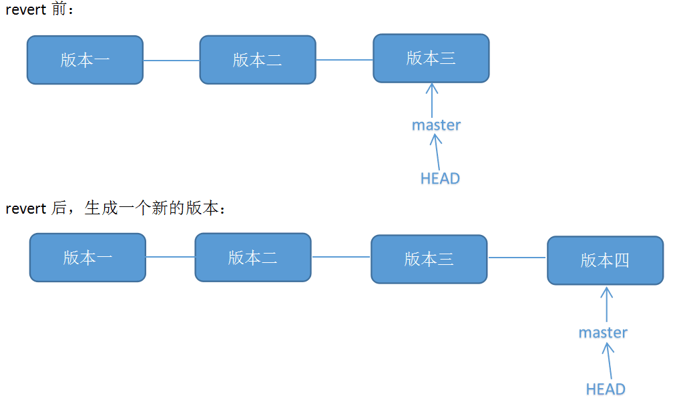

# Git 学习笔记

## Git 用户名和邮箱配置
安装完 Git 后一般要配置用户名和邮箱，以便在每次提交中记录下来，方便查找每次提交的用户。Git 的配置一共有三个级别：system（系统级）、global（用户级）、local（版本库）。system 的配置整个系统只有一个，global 的配置每个账号只有一个，local 的配置存在于 Git 版本库中，可以对不同的版本库配置不同的 local 信息。这三个级别的配置是逐层覆盖的关系，当用户提交修改时，首先查找 system 配置，其次查找 global 配置，最后查找 local 配置，逐层查找的过程中，若查询到配置信息，则会覆盖上一层配置，记录在提交记录中。
### system 配置
```shell
git config --system user.name "username"
git config --system user.email user@email.com
```
### global 配置
```shell
git config --global user.name "username"
git config --global user.email user@email.com
```
### local 配置
```shell
git config --local user.name "username"
git config --local user.email user@email.com
```
当有多个账号信息时，为了区分不同账户提交的记录。可以配置 global 为常用的用户和邮箱信息。对于不常用的，可以在对应的版本库里配置单独的用户和邮箱信息。

## Git 恢复之前提交版本
Git 恢复之前版本库有两种方法，`git reset` 和 `git revert`，即回退和反做。
### `git reset`
`git reset` 的作用是修改 HEAD 的位置，即将 HEAD 指向为想要退回的版本，然后丢弃该本版之后的所有版本。

适用场景： 如果想恢复到之前某个提交的版本，且那个版本之后提交的版本我们都不要了，就可以用这种方法。

1. `git log` 查看版本提交日志，找到要退回的版本号
```bash
> git log

commit 7699b36e6add2a7657b9ba205282a9d278d523c1
Author: imaginefish <imaginefishes@outlook.com>
Date:   Tue Apr 27 14:27:28 2021 +0800

    add frp反向代理应用.md

```
commit 后的 `7699b36e6add2a7657b9ba205282a9d278d523c1` 即为对于版本的版本号。

2. `git reset --hard 目标版本号` 回退指目标版本
```bash
git reset --hard 7699b36e6add2a7657b9ba205282a9d278d523c1
```
此时再用 `git log` 查看版本信息，此时本地的 HEAD 已经指向目标版本了。

3. `git push -f` 推送修改

因为本地版本库回退到了之前版本，与远程版本库版本不一致，会导致 `git push` 失败，需要使用 `git push -f` 强制推送至远程库。
### `git revert`
`git revert` 是用于“反做”某一个版本，生成一个新的版本，该版本丢弃了被“反做”版本所做的修改，以达到撤销该版本的修改的目的。

适用场景： 如果我们想撤销之前的某一版本，但是又想保留该目标版本后面的版本，记录下这整个版本变动流程，就可以用这种方法。

1. `git log` 查看版本提交日志，找到需要反做的版本号

2. `git revert -n 版本号` 进行反做

```bash
git revert -n 7699b36e6add2a7657b9ba205282a9d278d523c1
```

3. `git commit -m 版本信息` 提交修改

```bash
git commit m "revert xxxx"
```
此时可以用 `git log` 查看本地的版本信息，可见多生成了一个新的版本。

4. `git push` 推送至远程库

```bash
git push
```
## Git 修改文件名
直接修改文件名无法被 Git 提交到版本修改中，Git 会将原文件显示为 delete 状态。新修改名称的文件，在工作区，是未被追踪（untracked）状态，需要通过 `git mv` 命令修改文件名。
```bash
git mv old.txt new.txt
git commit -m 'change file old.txt to new.txt'
```
